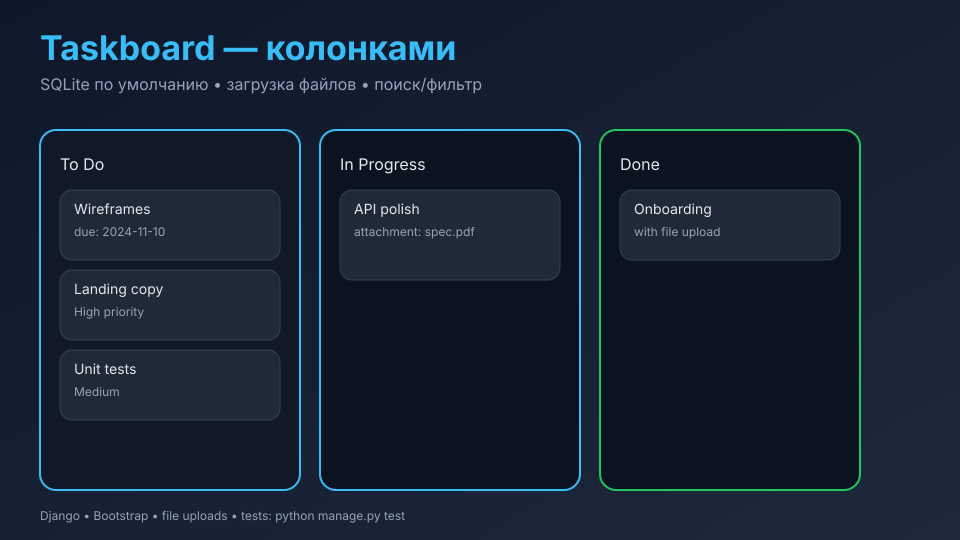

# Taskboard

Упрощённый Django-трекер задач с загрузкой файлов, фильтрами и поиском. Настроен на SQLite по умолчанию, но можно указать свои параметры БД через переменные окружения.

## Скриншот


## Quickstart (Docker)
```bash
cp .env.example .env
docker compose up --build
# UI: http://localhost:8000
```

## Локальный запуск
```bash
python -m venv .venv
. .venv/bin/activate
pip install -r requirements-dev.txt
python manage.py migrate
python manage.py createsuperuser  # по желанию
python manage.py runserver 0.0.0.0:8000
```
Откройте http://127.0.0.1:8000 — создайте аккаунт, добавьте задачу.

## Настройки окружения
- `DJANGO_SECRET_KEY` — секретный ключ (по умолчанию dev-secret).
- `DJANGO_DEBUG` — `true/false` (default: true).
- `DB_ENGINE/DB_NAME/DB_USER/DB_PASSWORD/DB_HOST/DB_PORT` — параметры БД (если не заданы, используется SQLite файл `db.sqlite3`).

## Возможности
- Задачи с полями: статус (To Do / In Progress / Done), приоритет (Low/Medium/High), дедлайн, описание.
- Поиск и фильтр по статусу, пагинация.
- Загрузка и скачивание файлов к задаче.
- Простые шаблоны на Bootstrap 4.

## Архитектура
- `config/` — настройки Django и маршрутизация.
- `myapp/tasks` — модели, формы, вьюхи, загрузка файлов.
- `templates/` — базовые шаблоны + auth.
- `static/` — стили/JS, плюс media-uploads в `media/`.
- Docker Compose поднимает Postgres + веб-приложение, миграции выполняются при старте.

## Команды управления
```bash
python manage.py runserver      # старт dev-сервера
python manage.py createsuperuser
python manage.py collectstatic  # для prod
```

## Тесты
```bash
python manage.py test
```
(минимальные smoke-тесты, база — SQLite in-memory).

## Структура
- `config/settings.py` — конфиг, env-friendly, SQLite по умолчанию.
- `myapp/tasks` — модели/формы/вьюхи задач.
- `templates/` — base, auth, списки/карточки задач.
- `static/` — базовые стили/скрипты.
- `docker-compose.yml` — приложение + Postgres, volume для media.

## Quality
- Линт/формат: `ruff check .`, `black --check .`
- Тесты: `python manage.py test`
- CI: (локально) `make` отсутствует, но docker compose + тесты запускаются одной командой.

MIT © Raphailinc
